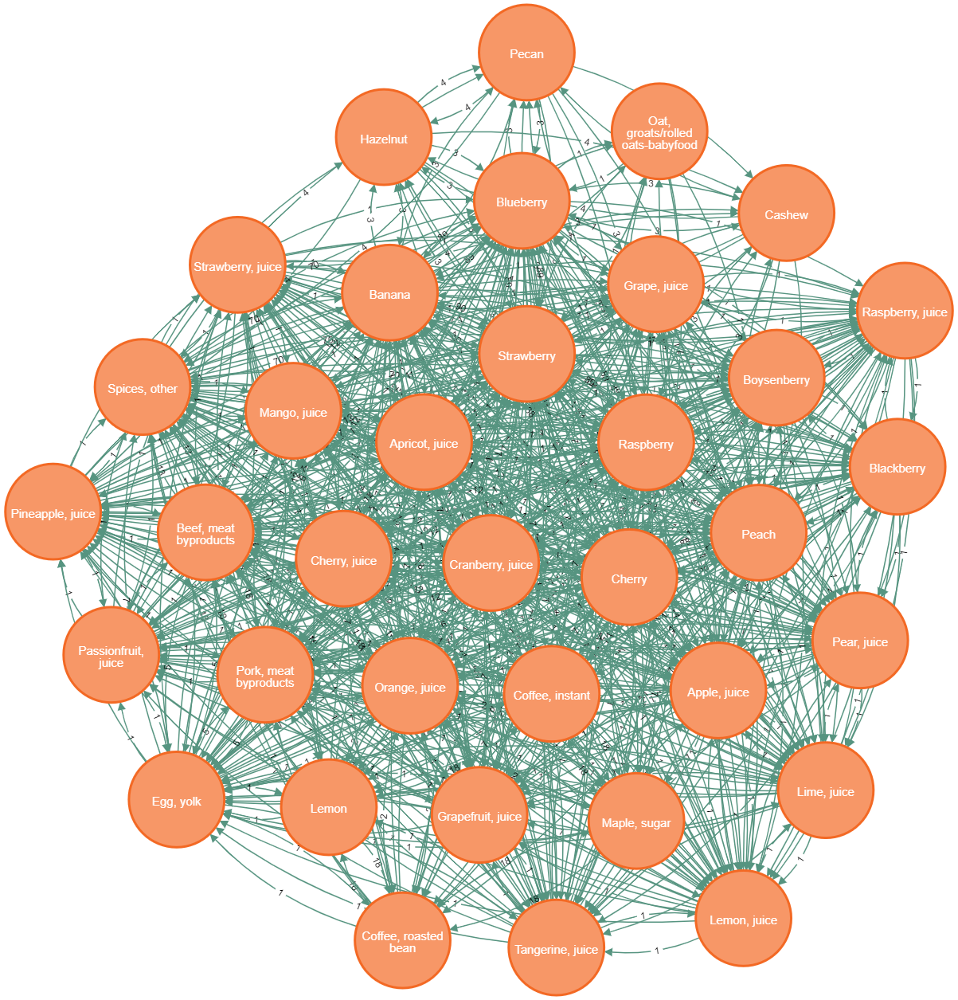

# Equipe Dinossauros, Bancos de dados e Coisas Parecidas (DBDCP)
### Davi Gabriel Bandeira Coutinho (183710)
### Francisco Vinicius Sousa Guedes (260440)
### Márcio Levi Sales Prado (183680)

## `data`
Os dados foram extraídos diretamente dos sites das pesquisas:
### External

[What we eat in America FCID ](https://fcid.foodrisk.org/dbc/)

[FoodDB](https://foodb.ca/)

[Food Consumption Data - Europa](https://www.efsa.europa.eu/en/data-report/food-consumption-data)

## `notebooks`
[Notebook com a criação das tabelas](notebooks/criando_tabelas_modelo_relacional.ipynb)

Implementamos as tabelas a partir dos arquivos CSVs. Para tabelas muito grandes como Contents e Intake foi necessário fazer um tratamento de dados.
### Página no Binder para execução do notebook 

## `src`

Respondemos às perguntas de análise em Cypher. Os códigos estão detalhados na seção de perguntas/análises.
Já para o notebook, fizemos a implementação em SQL e um script auxiliar em Python.

## Motivação e Contexto

> Com a constante aceleração do dia a dia, muitas pessoas optam por preencher suas refeições com comidas rápidas e processadas, fazendo escolhas não muito saudáveis.  Várias pesquisas estão preocupadas em mapear os 
hábitos alimentares das pessoas, como a 'What we eat in America?' e a 'Food Consumption Data' da EFSA, trazendo dados sobre o consumo de alimentos, considerando diversos aspectos de avaliação, tais quais país, idade 
e peso dos consumidores.

> O desenvolvimento e estudo dos hábitos alimentares da população também trazem à tona outras questões, dessa vez relacionadas à saúde dos consumidores já que a alimentação de uma pessoa pode nos dizer bastante sobre
sua saúde, como por exemplo indicar a deficiência de algum nutriente.

> Contudo, as pesquisas citadas acima não têm um detalhamento a nível de nutrientes dos itens consumidos. Nosso objetivo então é fornecer informações nutricionais sobre os hábitos alimentares da população alvo da 
pesquisa, realizando uma conexão entre as bases de dados de consumo com o FooDB. Também buscaremos trazer informações sobre receitas de alimentos, a partir da análise dos dados que detalham os ingredientes que as 
compõe.

## Slides

### Apresentação Final
> [Apresentação do Projeto](assets/Apresentação%20-%20Projeto%20Final.pdf)

## Modelo Conceitual

## Modelos Lógicos

> Modelo Lógico Relacional:
~~~
FOOD_CONSUMPTION_DATA(_Country_, _Year_, _Population_Group_, Exposure_Hierarchy_1, _Exposure_Hierarchy_7_, Number_of_Subjects, Number_of_Consumers, Percent_of_Consumers, Mean_Consumers, Mean_Subjects, 
Mean_Consumers_BW, Mean_Subjects_BW)

FOODS_RELATION(_Food_Desc_FCID_, _Exposure_Hierarchy_7_)
  Food_Desc_FCID chave estrangeira -> FOODS(Food_Desc)
  Exposure_Hierarchy_7 chave estrangeira -> FOOD_CONSUMPTION_DATA(Exposure_Hierarchy_7)

FOODS(_Food_Code_, Food_Abbrev_Desc, Food_Desc)

RECIPES(_Food_Code_, Mod_Code, Ingredient_Num, _FCID_Code_, Cooked_Status, Food_Form, Cooking_Method, Commodity_Weight)

FCID_DESCRIPTION(_FCID_Code_, FCID_Desc, CGN, CG_Subgroup)

INTAKE(_SEQN_, _DAYCODE_, DRABF, FCID_Code, Cooked_Status, Food_Form, Cooking_Method, Intake_AVG, Intake_SUM, Intake_BW_AVG)
  FCID_Code chave estrangeira -> FCID_DESCRIPTION(FCID_Code)

CROP_GROUP(_CGN_, _CGL_, Crop_Group_Description)
  CGN chave estrangeira -> FCID_DESCRIPTION(CGN)

RELATE_COMMODITY(_name_foodb_, _FCID_Desc_)
  name_foodb chave estrangeira -> FOOD(name)
  FCID_Desc chave estrangeira -> FCID_DESCRIPTION(FCID_Desc)

FOOD(_id_, name, name_scientific, description, itis_id, food_group, food_subgroup, food_type, public_id)

NUTRIENT(_id_, legacy_id, public_id, description, calories_per_gram)

COMPOUNDS(_id_, public_id, name)

CONTENT(_id_, source_id, _food_id_, orig_food_id, orig_food_id_common_name, orig_food_id_scientific_name, orig_content, orig_min, orig_max, orig_unit)
  id chave estrangeira -> NUTRIENT(id)
  id chave estrangeira -> COMPOUNDS(id)
  food_id chave estrangeira -> FOOD(id)
~~~
> Modelo Lógico de Grafos:

.png)
.png)
.png)
.png)
.png)
.png)
.png)

## Dataset Publicado

título do arquivo/base | link | breve descrição
----- | ----- | -----
`<EFSA_Intake.csv>` | `https://raw.githubusercontent.com/DaviGabrielBC/DBDCP---Projeto-Final/main/data/processed/efsa/EFSA_Intake.csv` | `<Base de dados de consumo da EFSA tratada>`
`<FCID_FooDB_matches.csv>` | `https://raw.githubusercontent.com/DaviGabrielBC/DBDCP---Projeto-Final/main/data/interm/FCID_FooDB_matches.csv` | `<Correspondências entre os alimentos das bases FCID e FooDB>`
`<EFSA_FooDB_matches.csv>` | `https://raw.githubusercontent.com/DaviGabrielBC/DBDCP---Projeto-Final/main/data/interm/EFSA_FooDB_matches.csv` | `<Correspondências entre os alimentos das bases EFSA e FooDB>`
`<Content_tratado_cropped.csv>` | `https://raw.githubusercontent.com/DaviGabrielBC/DBDCP---Projeto-Final/main/data/interm/Content_tratado_cropped.csv` | `<Base Content da FooDB tratada>`
`<Content_extra_cropped.csv>` | `https://raw.githubusercontent.com/DaviGabrielBC/DBDCP---Projeto-Final/main/data/interm/Content_extra_cropped.csv` | `<Base Content da FooDB simplificada ainda mais>`

## Bases de Dados
> 

título da base | link | breve descrição
----- | ----- | -----
`<EFSA_Intake>` | `<https://www.efsa.europa.eu/en/data-report/food-consumption-data>` | `<Base que contém os dados obtidos através de pesquisas de consumo de alimentos em vários países da Europa>`
`<FoodDB>` | `<https://foodb.ca/>` | `<Base de informações nutricionais dos alimentos>`
`<What we eat in America? - FCID>` | `<https://fcid.foodrisk.org/dbc/>` | `<Base que traz dados do consumo de comida nos Estados Unidos e receitas de alimentos>`

## Detalhamento do Projeto
O conjunto de bases de dados utilizado nas análises é composto de 3 bases de dados: FooDB, que traz informações nutricionais de diversos alimentos, detalhando inclusive suas composições. FCID (Food Commodity Intake
Database), cujos dados da tabela de consumo foram obtidos por meio de pesquisas endereçadas a consumidores. Essa base também contém informações sobre a composição de diferentes receitas, que trazem uma análise 
diferente das demais bases, nos permitindo ver como um alimento interage com outros no aspecto culinário. EFSA (European Food Consumption Data), também obtida por meio de pesquisas, mas dessa vez trazendo informações
sobre os consumidores e o consumo em relação a uma população, ou seja, algumas das tabelas dessa base não levam em conta apenas dados sobre as pessoas que de fato consumiram, mas de todas que foram entrevistadas, 
fornecendo dados mais robustos que nos permitem inferir hábitos alimentares sobre uma população em geral.

Nosso modelo conceitual conecta as 3 bases citadas acima, totalizando 12 tabelas. Essas conexões criam uma integração entre as bases, que nos permite usar dados de uma base para conseguir informações sobre 
consumo ou a formação de receitas detalhadas em outras bases, possibilitando também a comparação do consumo em diferentes lugares. A conexão entre essas bases se dá por meio de uma entidade de relacionamento obtida 
com o algoritmo em NLP simples, TF-IDF, encontrando equivalências entre as descrições dos alimentos em cada par de bases, no nosso caso para simplificar só fizemos entre FooDB <-> FCID e FooDB <-> EFSA, a relação entre EFSA <-> FCID é obtida com a base FooDB como intermediária.

Com base no modelo conceitual construímos o modelo relacional, onde cada entidade resultou em uma tabela, semelhantemente, cada atributo se tornou em uma coluna da respectiva tabela, inclusive as entidades 
intermediárias que realizavam a conexão entre as bases, as quais possuem 2 chaves estrangeiras e primárias, uma de cada base. Elas se tornaram tabelas intermediárias, responsáveis por registrar a equivalência entre 
um alimento de uma tabela e outro alimento da outra.

Para implementar o algoritimo de NLP, utilizamos a linguagem biblioteca Scikit-learn, que é utilizada para machine learning em geral, para tanto nós rodamos o código:
~~~python
import pandas as pd
from sklearn.feature_extraction.text import TfidfVectorizer
from sklearn.metrics.pairwise import cosine_similarity

# Carregar dados do FCID e do FoodDB (Configurar o ambiente para estar na raíz do repositório.)
fcid_data = pd.read_csv('bases/fcid/FCID_Code_Description.csv')
fooddb_data = pd.read_csv('bases/foodb/Food.csv')

# Pré-processamento: converter todos os nomes para minúsculas
fcid_data['processed'] = fcid_data['FCID_Desc'].str.lower()
fooddb_data['processed'] = fooddb_data['name'].str.lower()

# Usar TF-IDF para converter os nomes em vetores
vectorizer = TfidfVectorizer()
tfidf_matrix = vectorizer.fit_transform(fcid_data['processed'].tolist() + fooddb_data['processed'].tolist())

# Calcular a similaridade de cosseno
cosine_sim = cosine_similarity(tfidf_matrix[:len(fcid_data)], tfidf_matrix[len(fcid_data):])

# Encontrar a melhor correspondência para cada alimento do FCID
matches = []
for idx, row in enumerate(cosine_sim):
    best_match_idx = row.argmax()
    fcid_food = fcid_data.iloc[idx]['FCID_Desc']
    fooddb_food = fooddb_data.iloc[best_match_idx]['name']
    matches.append((fcid_food, fooddb_food))

# Criar um DataFrame com as correspondências
matches_df = pd.DataFrame(matches, columns=['FCID_Food', 'FoodDB_Food'])

# Salvar o DataFrame em um arquivo CSV
matches_df.to_csv('bases/relação/food_matches.csv', index=False)
~~~
O algoritmo pode ser dividido em alguns passos:
> Primeiramente carregamos os conteúdos das tabelas para as quais queremos encontrar textos equivalentes (ou seja, realizar matchs).

> Em seguida, padronizamos todas as letras para serem minúsculas

> Agora criamos o nosso vetor padrão (dicionário) com as palavras que serão comparadas, fazendo o encaixe das strings da outra tabela em forma de vetor

> Encontramos por fim, o vetor de ocorrência na tabela de referência que mais se adequa ao vetor que está sendo comparado da outra tabela, por meio da escolha do maior valor de similaridade de cosseno, já que quanto
mais próximos 2 vetores num espaço n-dimensional, menor o ângulo entre eles (próximo de 0) e portanto maior o cosseno desse ângulo (próximo de cos(0) = 1), ou seja, basta selecionar o vetor que tem a maior
cosine_similarity() com o vetor comparado atualmente.

A partir disso, conseguimos construir o relacionamento entre as tabelas FCID_Code_Description e Foods, assim como o relacionamento entre as tabelas EFSA_Intake e Foods, ligando as tabelas e possibilitando a 
classificação quanto a nutrientes.
O modelo lógico de grafos procura ligar alimentos com dados sobre o seu consumo, ingredientes com as receitas que os usam, grupos e subgrupos com os alimentos que estão dentro deles e alimentos de diferentes bases 
para os quais encontramos correspondências entre suas descrições. Porém, percebemos que o modelo de grafos era mais viável para reponder perguntas com foco na base de dados FCID, em específico sobre as receitas e os
ingredientes que as compõem, por isso decidimos só tratar das tabelas da FCID, criando apenas os vértices e arestas dela advindos. Durante as consultas, percebemos que os atributos da Recipes que não eram chaves
estrangerias estavam criando múltiplas instâncias de uma mesma aresta, e como os atributos eram desnecessários para nossas perguntas de análise, acabamos ignorando-os na hora de carregar a Recipes no Neo4j. Também
enquanto fazíamos as consultas, criamos novas conexões, como por exemplo, ligar 2 ingredientes sempre que eles são usados em uma mesma receita, conseguimos assim, novas possibilidades de perguntas de análise, além de
tornar o grafo mais homogêneo, permitindo-nos aplicar diversos algoritmos sobre análises em redes complexas.

Por fim, elaboramos perguntas que pudessem ser respondidas pelos nossos modelos, dando ênfase à composição de receitas para as perguntas do modelo de grafos e no modelo relacional, dando ênfase à integralização das 
bases de dados, comparando o consumo com diferentes parâmetros avaliativos, como ano da pesquisa, faixa etária e peso do consumidor, país em que foi feita a pesquisa e até mesmo diferentes pontos de vista sobre 
conceitos que trazem uma informação mais concreta sobre os dados disponíveis. Consideramos também os aspectos citados na motivação e contexto, como por exemplo a relação entre saúde e alimentação.

## Evolução do Projeto
Começamos escolhendo uma base de dados complementar que tivesse uma conexão com as bases de dados centrais, nos permitindo analisar dados de consumo e nutricionais por meio de hábitos alimentares.
Em seguida partimos para a construção do modelo conceitual a partir das bases de dados disponíveis. Durante a construção desse modelo, encontramos vários obstáculos: Como relacionar 2 bases de dados diferentes? A 
solução que encontramos era relacionar os tipos de alimentos entre si, por meio de correspondências entre alimentos que possuem uma descrição semelhante, e para isso tivemos de recorrer a um algoritmo NLP que 
relacionava cada string de identificação de um alimento da primeira tabela com também uma string de identificação de um alimento da segunda tabela, achando a equivalência mais próxima possível. desses alimentos e 
fazia a relação de equivalência, indicada por uma entidade de relacionamento, no qual utilizamos um modelo simples de NLP, que usou a técnica de TF-IDF. Além disso, algumas tabelas se encontravam no formato de 
matrizes de adjacência, pois cada linha indicava a relação entre por exemplo, um ingrediente e uma receita que usava o mesmo, tornando a modelagem no modelo conceitual um pouco menos intuitiva do que no modelo de 
grafos. Também decidimos ocultar algumas tabelas/entidades que não contribuam para nossas análises.

Na modelagem relacional não encontramos muitos problemas, em geral traduzimos o modelo conceitual para o relacional seguindo as regras de cardinalidade de relacionamentos, adicionando novos atributos e criando 
tabelas intermediárias quando preciso. Na base de dados EFSA encontramos 4 tabelas, todas com informações úteis para possíveis análises, contudo elas possuem esquemas bem semelhantes, diferindo apenas de 1 ou 2 
colunas, além de contar com informações pouco relevantes para nossas análises, referentes a curva gaussiana de consumo (exceto a média, que é nossa principal métrica). Para resolver isso, simplesmente removemos 
as colunas pouco relevantes e adicionamos novos atributos à tabela, referentes às outras tabelas, conseguindo assim unir todos os dados em uma só tabela, sem aumentar o número total de colunas e obtendo uma tabela 
bem propícia para as nossas análises. Um outro obstáculo encontrado foi durante a localização das chaves estrangeiras, já que a nomeação dos atributos tornava essa busca um pouco ambígua. Porém, observar as tabelas 
em um arquivo foi suficiente para identificar essas chaves. Utilizamos o binder para fazer a implementação das tabelas, vide o notebook.

Já no modelo lógico de grafos, a modelagem foi um pouco mais intuitiva, pois, como dito anteriormente, muitas tabelas do nosso conjunto de bases estavam já preparadas para o modelo de grafos, o maior desafio foi 
durante a implementação dos mesmos, que precisava do desenvolvimento de algumas linhas de código a mais para conectar os nós mediante as conexões impostas por uma terceira tabela.

Durante a seleção de perguntas tivemos um foco maior nas perguntas a serem respondidas pelo modelo lógico de grafos, mas formulamos várias perguntas para o modelo lógico relacional, levando em conta fatores que 
adicionavam um ponto de vista a mais para nossa análise, como por exemplo: o que caracteriza o ingrediente mais utilizado em um conjunto de receitas? A soma das quantidades que foram efetivamente utilizadas nessas 
receitas? Ou em quantas receitas o ingrediente foi utilizado? Também pensamos em calcular métricas relacionadas à saúde dos consumidores, citamos aqui a ideia de um consumo médio de alimentos, que juntamente com as 
informações nutricionais da FooDB nos proporcionava uma estimativa média sobre o consumo de cada grupo populacional, em diferentes países e anos. Fomos evoluindo as nossas perguntas conforme criávamos o nosso modelo
relacional e aprofundávamos nosso entendimento sobre a importância do tópico. 

Na criação de perguntas para o modelo lógico de grafos, tentamos envolver os conceitos de análise de rede complexas, dando ênfase à conexão formada quando um ingrediente é utilizado em uma receita, indicada pela 
tabela Recipes da base de dados FCID, sendo esse o ponto principal da nossa análise. Podemos ressaltar a seguinte pergunta: É possível encontrar um conjunto de ingredientes que são utilizados em um mesmo conjunto 
de receitas? Que busca por meio dos conceitos de modularidade encontrar uma comunidade de ingredientes, tendo como condição para a criação de uma aresta se 2 ingredientes estão numa mesma receita.

Chegamos a colocar as tabelas tratadas em um notebook do binder, disponível para fazer consultas. Entretanto, não chegamos a implementar as perguntas de análise. Durante esse processo, acabamos diagnosticando um
grande problema para a implementação, tanto em SQL como Cypher: a tabela RECIPES estava fazendo algumas consultas excederem o limite de memória, e por isso decidimos por restringí-la a apenas 5261 linhas, que
certamente elimina bastante informação, mas remove vários obstáculos para a implementação das nossas consultas. Além de que deve deixar o grafo menos denso e mais visível, pois o número de ingredientes não muda de
qualquer forma.

Por fim, conseguimos realizar nossas consultas sobre o modelo lógico de grafos. Inicialmente apenas pensamos em procurar vértices com alta centralidade de grau, mas ao explorar o grafo por meio de consultas sobre as 
relações entre receitas e ingredientes, descobrimos alguns conjuntos de ingredientes que só se relacionavam com um certo conjunto de receitas e vice-versa (ou seja, esses ingredientes eram os únicos que compunham um 
pequeno conjunto de receitas) então decidimos analisar o conceito de comunidades. Exploramos o algoritmo de Louvain que realiza a detecção de comunidades de maneira satisfatória e eficiente, adicionando arestas a 
cada passo, buscando maximizar a modularidade do grafo. Aplicando o algoritmo ao nosso grafo, nós de fato encontramos uma comunidade com o perfil descrito acima, verificamos suas descrições por meio do campo 
FCID_Desc e achamos uma característica comum a todos esses vértices: eles são comida de bebê, o que faz muito sentido pois comida de bebê não é utilizada em nenhuma outra receita fora alimentos para bebês e da mesma 
forma, apenas alimentos apropriados para bebês são utilizados em receitas para bebês. Também achamos outras comunidades que detalharemos mais adiante. 

Após isso prosseguimos com outra ideia inicial, uma forma de sugestão de receitas, baseada na seguinte questão: Dado que uma pessoa gosta de uma receita, é possível prever que ela gostará de uma outra? 
A solução torna-se intuitiva, uma vez que temos acesso aos ingredientes que compõem aquela receita, basta então selecionar receitas que têm uma composição de ingredientes similar, porém esta análise ainda não parece 
prever otimamente, então tivemos uma ideia que não foi implementada, onde consideramos os commodity_weight de cada ingrediente na receita e por meio da comparação não só dos ingredientes presentes nas 2 receitas, 
mas também dos seus commodity_weight, poderíamos de fato ver o quanto daquela receita é similar a outra e se essa similaridade fosse maior que uma certa porcentagem/constante, então esta receita poderia 
automaticamente sugerir a outra. O motivo de não a implementarmos é devido a algumas receitas que possuem instâncias de um mesmo ingrediente, porém em formas diferentes, uma possível solução seria colocar o código de
modificação, cozimento e outros parâmetros de cada ingrediente em uma receita, como atributos/propriedades do próprio vértice ingrediente, que aumentaria bastante o número de ingredientes e certamente deixaria o 
grafo de combinações ou mais esparso já que 'dividimos' algumas arestas de um mesmo ingrediente entre suas modificações, ou bem mais volumoso, já que teríamos mais vértices e cada modificação de um ingrediente se 
ligaria a cada modificação do outro, assim o número de arestas iria de O(1) a O(n²). Além de que precisaríamos de um conjunto de aproximadamente 6 atributos para construir o índice de cada ingrediente, dificultando 
todas as outras análises.

Em meio a essas análises, continuávamos sempre analisando o gráfico retornando um conjunto pequeno de vértices (tanto ingredientes quanto receitas, a depender da consulta feita) por meio do LIMIT X. Percebemos 
facilmente uma espécie de cluster no grafo, principalmente de ingredientes, já que vários deles estavam em uma mesma receita (principalmente as comunidades que encontramos, pois aproximadamente 1/5 dos ingredientes 
são parte de uma comunidade que contém outros nós fora si próprio) e então buscamos um algoritmo que calcula o coeficiente de clusterização ao redor de cada nó (no nosso caso, cada ingrediente). Encontramos então 55
nós com coeficiente de clusterização 1.0 e retornamos o resultado em forma de PNG que será discutido na seção de perguntas/análise. 

Por sinal, tivemos um grande problema ao aplicar o algoritmo de cálculo da centralidade de grau de cada vértice, pois os vérticies aos quais eles estavam ligados possuiam também uma grande 
quantidade de arestas entre si, que nos impossibilitava de retornar um grafo que continha apenas as arestas de interesse, além de dificultar bastante a visibilidade dos vérticies/arestas do grafo por ser muito
denso. Para desviar desse problema, tivemos de carregar novamente a tabela de ingredientes e apenas recriar as relações (arestas) "Combina" para os 3 vértices com centralidade de grau = 105.0, deixando o grafo bem
limpo e visível, imagens serão mostradas em outra seção.

## Perguntas de Pesquisa/Análise Combinadas e Respectivas Análises

### Perguntas/Análise com Resposta Implementada

> Como todas as perguntas foram feitas em Cypher, vamos primeiramente carregar todos os arquivos que serão utilizados para a nossa base e inicializar arestas/índices gerais

Carregando os Alimentos
~~~cypher
LOAD CSV WITH HEADERS FROM 'https://raw.githubusercontent.com/DaviGabrielBC/DBDCP---Projeto-Final/main/data/processed/fcid/Food_Code_Description.csv' AS line
CREATE (:Alimento {Food_Code: line.Food_Code, Food_Abbrev_Desc: line.Food_Abbrev_Desc, Food_Desc: line.Food_Desc})
~~~
Carregando os Ingredientes
~~~cypher
LOAD CSV WITH HEADERS FROM 'https://raw.githubusercontent.com/DaviGabrielBC/DBDCP---Projeto-Final/main/data/processed/fcid/FCID_Code_Description.csv' AS line
CREATE (:Ingrediente {CGN: line.cgn, CG_Subgroup: line.CG_Subgroup, FCID_Code: line.FCID_Code, FCID_Desc: line.FCID_Desc})
~~~
Criando índice para Alimentos
~~~cypher
CREATE INDEX FOR (a: Alimento) ON (a.Food_Code)
~~~
Criando índice para Ingredientes
~~~cypher
CREATE INDEX FOR (i: Ingrediente) ON (i.FCID_Code)
~~~
Carregando a Recipes
~~~cypher
LOAD CSV WITH HEADERS FROM 'https://raw.githubusercontent.com/DaviGabrielBC/DBDCP---Projeto-Final/main/data/raw/fcid/Recipes_WWEIA_FCID_0510_cropped.csv' AS line
MATCH (a: Alimento {Food_Code: line.Food_Code})
MATCH (i: Ingrediente {FCID_Code: line.FCID_Code})
MERGE (a)-[r:Recipes]->(i)
ON CREATE SET r.weight = 1
ON MATCH SET r.weight = r.weight + 1
~~~
Consulta feita para verificar o progresso até aqui
~~~cypher
MATCH (n :Alimento)-[e]->(m: Ingrediente)
RETURN n, m
LIMIT 5
~~~
> 

Carregando a Crop_Group_Description
~~~cypher
LOAD CSV WITH HEADERS FROM 'https://raw.githubusercontent.com/DaviGabrielBC/DBDCP---Projeto-Final/main/data/processed/fcid/FCID_Cropgroup_Description.csv' AS line
CREATE (:Grupo {CGN:  line.CGN, CGL:  line.CGL, Crop_Group_Description: line.Crop_Group_Description})
~~~
Criando índice para os grupos de cultura
~~~cypher
CREATE INDEX FOR (g: Grupo) ON (g.CGL)
~~~
Criando as arestas que indicam a qual grupo cada ingrediente pertence
~~~cypher
MATCH (i :Ingrediente)
MATCH (g :Grupo)
WHERE i.CGN = g.CGN AND i.CG_Subgroup = g.CGL
CREATE (g)-[:Agrupa]->(i)
~~~
Novamente verificamos o progresso feito até o momento
~~~cypher
MATCH (g :Grupo)-[e]->(i :Ingrediente)
RETURN i, g
LIMIT 50
~~~
> 

E agora, criamos as arestas que serão o principal foco de nossas análises:
ligamos 2 ingredientes se eles estão em uma mesma receita, incrementando 
o peso de tal aresta se encontramos outra receita em comum:
~~~cypher
MATCH (i1 :Ingrediente)<-[:Recipes]-(r)-[:Recipes]->(i2 :Ingrediente)
WHERE i1.FCID_Code <> i2.FCID_Code
MERGE (i1)-[c:Combina]->(i2)
ON CREATE SET c.weight = 1
ON MATCH SET c.weight = c.weight + 1
~~~
E fazemos mais uma consulta para enxergar visualmente o que acabamos de fazer
~~~cypher
MATCH (i1)-[:Combina]->(i2)
RETURN i1, i2
LIMIT 3
~~~
> 

Note que escolhemos 2 arestas, uma em cada direção (a -> b) e (b -> a) para
evitar problemas trazidos por arestas unidirecionais, como no cálculo do grau
de um vértice.

#### Pergunta/Análise 1
> * Pergunta 1
>   
>   * No contexto das receitas de alimentos, é possível localizarmos uma comunidade
>     de ingredientes que aparecem juntos em várias receitas?
>   * Para responder essa pergunta utilizaremos o algoritmo de Louvain que consegue
>     detectar comunidades colocando uma aresta por vez de modo a maximizar a nova
>     modularidade do grafo a cada passo.
>     Então começamos criando a projeção do nosso grafo cujas arestas dizem se 2
>     ingredientes estão presentes em uma mesma receita (com peso).
>     ~~~cypher
>     CALL gds.graph.project(
>       'ingredientGraph',
>       'Ingrediente',
>       'Combina'
>     )
>     ~~~
>     E agora aplicamos o algoritmo de Louvain, gerando uma tabela que indica para
>     cada descrição de alimento, o id da comunidade (gerado pelo próprio algoritmo)
>     a qual ele pertence.
>     ~~~cypher
>     CALL gds.louvain.stream('ingredientGraph')
>     YIELD nodeId, communityId
>     RETURN gds.util.asNode(nodeId).FCID_Desc AS name, communityId
>     ORDER BY communityId ASC
>     ~~~
>     Que gerou a tabela acessada pelo seguinte link: [Louvain - Results](https://github.com/DaviGabrielBC/DBDCP---Projeto-Final/blob/main/assets/tables/export%20(1).csv)
>     Por inspeção, detectamos 4 comunidades. Demonstraremos então a consulta feita
>     para encontrar cada uma delas separadamente (pois seria muito pesado juntá-las).
>   * Comunidade de id = 312
>     ~~~cypher
>     CALL gds.louvain.stream('ingredientGraph')
>     YIELD nodeId, communityId
>     MATCH (i :Ingrediente)
>     WHERE i.FCID_Code = gds.util.asNode(nodeId).FCID_Code AND communityId = 312
>     RETURN i
>     ~~~
>     
>   * Comunidade de id = 315
>     ~~~cypher
>     CALL gds.louvain.stream('ingredientGraph')
>     YIELD nodeId, communityId
>     MATCH (i :Ingrediente)
>     WHERE i.FCID_Code = gds.util.asNode(nodeId).FCID_Code AND communityId = 315
>     RETURN i
>     ~~~
>     
>   * Comunidade de id = 316
>     ~~~cypher
>     CALL gds.louvain.stream('ingredientGraph')
>     YIELD nodeId, communityId
>     MATCH (i :Ingrediente)
>     WHERE i.FCID_Code = gds.util.asNode(nodeId).FCID_Code AND communityId = 316
>     RETURN i
>     ~~~
>     
>   * Comunidade de id = 540
>     ~~~cypher
>     CALL gds.louvain.stream('ingredientGraph')
>     YIELD nodeId, communityId
>     MATCH (i :Ingrediente)
>     WHERE i.FCID_Code = gds.util.asNode(nodeId).FCID_Code AND communityId = 540
>     RETURN i
>     ~~~
>     
>   * Fiz uma outra inspeção que mostrava além do nome de cada ingrediente, também os 
>     subgrupo de cultura aos quais eles pertenciam, que me ajudou a concluir que 
>     muitos alimentos de um mesmo subgrupo estavam em uma comunidade, como sucos em 
>     uma, alimentos de bebê em outra, etc.
>     ~~~cypher
>     CALL gds.louvain.stream('ingredientGraph')
>     YIELD nodeId, communityId
>     MATCH (g:Grupo)
>     WHERE g.CGL = gds.util.asNode(nodeId).CG_Subgroup
>     RETURN gds.util.asNode(nodeId).FCID_Desc AS name, g.Crop_Group_Description, communityId
>     ORDER BY communityId ASC
>     ~~~
>     Que gerou a tabela acessada pelo seguinte link: [Louvain - Results - Crop_Group](https://github.com/DaviGabrielBC/DBDCP---Projeto-Final/blob/main/assets/tables/export%20(3).csv)
>     Note que eu fiz o MATCH levando em conta o Subgroup pois há vários subgroup
>     dentro de um mesmo Crop_Group, que levaria a uma imprecisão grande. Também, há
>     alguns subgrupos de alimentos que não estão presentes na tabela Crop_Group_Description
>     como 1AB e 1CD, e portanto esses ingredientes não estão representados na tabela.
#### Pergunta/Análise 2
> * Pergunta 2
>   
>   * Dado que uma pessoa gosta de uma receita, é possível prever
>     que ela gostará de uma outra receita?
>   * A ideia utilizada aqui consiste em analisar alimentos que têm receitas 
>     que possuem muitos ingredientes em comum, ou seja, são semelhantes e então
>     se uma pessoa gosta de uma receita, ela provavelmente gostaria da outra. 
>     ~~~cypher
>     MATCH (a1 :Alimento)-[b]->(i :Ingrediente)<-[c]-(a2 :Alimento)
>     MERGE (a1)-[s:Sugere]->(a2)
>     ON CREATE SET s.weight = 1
>     ON MATCH SET s.weight = s.weight + 1
>     ~~~
>     Como um chute inicial para explorar o comportamento do grafo, configuramos 
>     que 2 receitas precisariam ter pelo menos 100 ingredientes em comum, para 
>     serem consideradas semelhantes porém a consulta não deu nenhum resultado. 
>     Fomos então diminuindo para 50, depois 25, e por fim 20, que já trouxe um 
>     resultado expressivo:
>     
>     
>   * Porém, por ser um resultado bem simples, (19 também) resolvemos destacar
>     aqui apenas os casos em que essa quantidade de ingredientes em comum (que no 
>     código trataremos como peso da aresta Sugere) nos quais o peso é > 18:
>     ~~~cypher
>     MATCH (a1)-[s:Sugere]->(a2)
>     WHERE s.weight > 18
>     RETURN a1, a2
>     LIMIT 100
>     ~~~
>     
>   * E peso > 16:
>     ~~~cypher
>     MATCH (a1)-[s:Sugere]->(a2)
>     WHERE s.weight > 16
>     RETURN a1, a2
>     LIMIT 100
>     ~~~
>     
>   * Podemos notar que todos esses alimentos são derivados de leite, incluindo os vários
>     tipos de "ICE CREAM" que aparecem, de fato, muitas dessas receitas são apenas
>     sorvete com uma cobertura diferente (um é de chocolate, outro de caramelo por 
>     exemplo) que certamente atendem ao nosso objetivo de sugerir um alimento com uma
>     receita bastante próxima de outro que uma pessoa gosta. Contudo, veja também que 
>     esse é um bom exemplo da análise levantada acima, que por exemplo, se uma pessoa
>     gosta de sorvete de chocolate, ela não necessariamente gostará de um sorvete de 
>     manga, apesar de que os 2 podem ter uma receita bem parecida, senão de uns poucos
>     ingredientes principais, que são utilizados em quantidade suficiente para mudar o
>     sabor do alimento.
#### Pergunta/Análise 3
> * Pergunta 3
>   
>   * Qual o ingrediente que mais combina com outros?
>   * Essa pergunta pode ser respondida vendo qual vértice tem maior centralidade
>     de grau na nossa relação (i)-[:Combina]->(j), indicando que esse tal vértice
>     representa o ingrediente que está combinado com mais ingredientes em receitas.
>     Note que outra interpretação possível para esse problema seria apenas analisar
>     em quantas receitas um ingrediente está, e selecionar o ingrediente que está
>     em mais receitas, todavia, este nosso método leva em consideração a complexidade
>     de cada receita, ou seja, quantos ingredientes compõem a receita ao qual o 
>     ingrediente pertence, pois quanto maior esse número, maior a abilidade de um
>     ingrediente de combinar com outros. 
>     Dito isto, basta então analisar o vértice de maior centralidade de grau.
>     Primeiro projetamos o grafo (caso não tenha sido feito para a pergunta 1)
>     ~~~cypher
>     CALL gds.graph.project(
>       'ingredientGraph',
>       'Ingrediente',
>       'Combina'
>     )
>     ~~~
>     Em seguida chamamos o método que calcula o grau de cada vértice
>     ~~~cypher
>     CALL gds.degree.stream('ingredientGraph')
>     YIELD nodeId, score
>     RETURN gds.util.asNode(nodeId).FCID_Desc AS name, score AS Combinações
>     ORDER BY Combinações DESC, name DESC
>     ~~~
>     Fornecendo uma tabela cujo esquema é dado por (Nome do Ingrediente, Grau do Vértice)
>     onde o grau do vértice é simplesmente um indicativo numérico de quantos alimentos
>     aquele ingrediente combina com [Degree Centrality - Results](https://github.com/DaviGabrielBC/DBDCP---Projeto-Final/blob/main/assets/tables/export%20(2).csv)
>     Agora, como descrito na evolução do projeto, para mostrar apenas as arestas que saem
>     desses 3 vértices de maior grau, eu precisei recriar os vértices e as arestas porém
>     ignorando as arestas que não ligam nenhum dos vértices que têm esse maior grau de 105.0.
>     Aqui crio os novos nós de ingredientes:
>     ~~~cypher
>     LOAD CSV WITH HEADERS FROM 'https://raw.githubusercontent.com/DaviGabrielBC/DBDCP---Projeto-Final/main/data/processed/fcid/FCID_Code_Description.csv' AS line
>     CREATE (:ingrediente {CGN: line.cgn, CG_Subgroup: line.CG_Subgroup, FCID_Code: line.FCID_Code, FCID_Desc: line.FCID_Desc})
>     ~~~
>     E conecto apenas os nós relevantes
>     ~~~cypher
>     CALL gds.degree.stream('ingredientGraph')
>     YIELD nodeId, score
>     MATCH (i :Ingrediente)-[e]->(n)
>     MATCH (j :ingrediente)
>     MATCH (k :ingrediente)
>     WHERE i.FCID_Code = gds.util.asNode(nodeId).FCID_Code AND score = 105.0 AND j.FCID_Code = i.FCID_Code AND k.FCID_Code = n.FCID_Code
>     MERGE (j)-[c:combina]->(k)
>     ON CREATE SET c.weight = 1
>     ON MATCH SET c.weight = c.weight + 1
>     ~~~
>     Por fim, retornamos o resultado como desejado:
>     ~~~cypher
>     MATCH (i)-[:combina]->(j)
>     RETURN i, j
>     ~~~
>     
>   * Veja como o próprio Neo4j tende a colocálos no centro, pois eles de fato
>     possuem uma alta centralidade, nesse caso, de grau. Também vale notar
>     que esses 3 vértices de grau 105 estão conectados uns aos outros (exceto
>     a si próprios) e a 103 vértices em comum.
#### Pergunta/Análise 4
> * Pergunta 4
>   
>   * Como se dá a clusterização dos ingredientes considerando a relação de 
>     combinação entre cada par de ingredientes?
>   * Vamos calcular o coeficiente de clusterização para cada nó.
>     Primeiramente, vamos projetar o grafo de Ingredientes com a relação
>     Combina, mas dessa vez com arestas não direcionadas, pois não podemos
>     calcular os coeficientes com arestas direcionadas:
>     ~~~cypher
>     CALL gds.graph.project(
>       'ingredientGraph_undirected',
>       'Ingrediente',
>       {
>         Combina: {
>           orientation: 'UNDIRECTED'
>         }
>       }
>     )
>     ~~~
>     Chamamos então o método que ira calcular esse coeficiente para cada nó
>     ~~~cypher
>     CALL gds.localClusteringCoefficient.stream('ingredientGraph_undirected')
>     YIELD nodeId, localClusteringCoefficient
>     RETURN gds.util.asNode(nodeId).FCID_Desc AS name, localClusteringCoefficient
>     ORDER BY localClusteringCoefficient DESC
>     ~~~
>     Resultando numa tabela que registra o coeficiente de clusterização local sobre cada nó
>     [Local Clustering Coefficient](https://github.com/DaviGabrielBC/DBDCP---Projeto-Final/blob/main/assets/tables/export%20(4).csv)
>     Para completar a análise, decidimos retornar as relações de todos os nós que têm
>     localClusteringCoefficient = 1.0, por meio da consulta:
>     ~~~cypher
>     gds.localClusteringCoefficient.stream('ingredientGraph_undirected')
>     YIELD nodeId, localClusteringCoefficient
>     MATCH (i :Ingrediente)-[:Combina]->(n)
>     WHERE i.FCID_Code = gds.util.asNode(nodeId).FCID_Code AND localClusteringCoefficient = 1.0
>     RETURN i, n
>     ~~~
>     
>   * Eu achei esse grafo bem interessante, pois ele não só mostra um "enxame" de vértices
>     que pude verificar que contém todas as 4 comunidades
>     "Spices, other" - 540
>     "Cocoa bean, chocolate" - 312
>     "Egg, white" - 316
>     "Water, indirect, all sources" - 315
>     Mas também contém os ingredientes de comidas de bebê deslocados do cluster principal
>     para o canto direito, só não separados por causa do nó intermediário cuja descrição 
>     é "Water, indirect, all sources" que é colocado justamente na comunidade dos alimentos
>     de bebê pelo algoritmo de Louvain. Apesar de não ser o objetivo principal dessa análise,
>     essa separação nos ajuda a ver nitidamente as comunidades, ou pelo menos a comunidade
>     das comidas de bebê e uma união das outras 3 comunidades principais. 
### Perguntas/Análise Propostas mas Não Implementadas

#### Pergunta/Análise 1
> * Pergunta 1
>   Como o consumo médio na Europa mudou ao longo dos anos de 1997 até 2019?
>   * Podemos agrupar os dados de consumo por ano e por alimento, somando todos esses dados de consumo 
>     a cada ano. Em seguida, somamos esses dados de consumo em cada ano e dividimos por 365, já que cada 
>     dado da tabela que escolhemos da nossa base é referente ao consumo em um dia. Somando sobre todo
>     alimento teríamos um consumo total, que em seguida podemos relacionar com o FooDB obtendo as
>     informações nutricionais desse consumo médio. Essas informações podem ser dispostas em uma tabela para
>     cada ano e nutriente, permitindo uma comparação ao longo dos anos. 
>   * Note que esta pergunta pode trazer dados (inclusive gráficos se organizados corretamente por meio de um
>     software) sobre a mudança no consumo em uma mesma região ao longo dos anos, apontando para fatores 
>     tecnológicos dentre outros, nos ajudando a entender bastante sobre a mudança dos hábitos alimentares
>     ao longo do tempo.

#### Pergunta/Análise 2
> * Pergunta 2
>   Quais os alimentos que mais contribuem para o total calórico de cada receita?
>   * Aqui fazemos uma simples análise selecionando para cada receita, o total calórico de cada ingrediente
>     finalizando com a aplicação de um MAX.
>   * Podemos estudar por um ângulo diferente qual o alimento que de fato é mais relevante nutritivamente
>     para uma receita, auxiliando com inúmeras análises sobre cada receita.

#### Pergunta/Análise 3
> * Pergunta 3
>   Quais os alimentos que cada grupo populacional mais consome? E qual o perfil calórico desses alimentos?
>   * Novamente agrupamos por grupo populacional a tabela EFSA_Intake, porém aqui temos 2 análises 
>     possíveis: consumo total em gramas, ou a quantidade de pessoas que consomem o alimento. No primeiro
>     caso somar o consumo em gramas a partir do GROUP BY. Já no segundo caso, basta tomar o SUM
>     sobre o Number_of_Consumers para todo registro de cada grupo populacional consumindo aquele alimento. 
>     Assim, tomamos o MAX em ambos os casos, retornando o Exposure_Hierarchy_7 (nome) daquele alimento.
>     Por fim, voltamos para a FooDB e analisamos o perfil calórico desses alimentos.
>   * Observe que essa pergunta nos permite definir de uma forma bem sucinta, porém não representativa o perfil
>     nutricional de cada grupo populacional.

#### Pergunta/Análise 4
> * Pergunta 4
>   Para cada grupo de alimento, qual o alimento pertencente a este grupo que é mais consumido?
>   * Dessa vez, respondemos à pergunta na direção inversa: agrupamos por Exposure_Hierarchy_1
>     e temos 2 possíveis análises outra vez, consumo total em gramas ou quantas pessoas consomem
>     aquele alimento. Fazemos as mesmas consultas da análise anterior, porém dessa vez utilizamos
>     um MAX sobre o grupo ao qual o alimento pertence (nesse caso o grupo é indicado pela coluna
>     Exposure_Hierarchy_1).
>   * Essa análise nos ajuda a localizar qual o alimento mais requisitado em cada grupo, trazendo uma
>     informação que oference bastante proveito.

#### Pergunta/Análise 5
> * Pergunta 5
>   Qual o alimento mais consumido em cada país, levando em conta o peso do consumidor?
>   * Para responder a esta pergunta basta novamente agrupar por país e considerar agora o 
>     consumo por body_weight, indicado por uma coluna específica da tabela EFSA_Intake.
>     Então, tomamos o MAX por cada país. Contudo, mais uma vez encontramos o mesmo
>     "problema" em que há 2 julgamentos possíveis sobre o que é um indicador de maior
>     consumo, podemos assim aplicar a mesma estratégia fazendo:
>     1) SUM sobre Number_of_Consumers
>     2) SUM sobre Intake_Mean_BW
>   * Por meio do resultado desta pergunta, podemos obter uma avaliação considerando
>     o peso do consumidor (trazendo um fator de balanceamento devido à relação entre o 
>     peso de uma pessoa e o quanto ela necessita consumir) do consumo em cada país.

#### Pergunta/Análise 6
> * Pergunta 6
>   Qual grupo de alimentos é mais utilizado para fazer receitas?
>   * Diferentemente das demais, para responder essa pergunta precisamos acessar
>     as tabelas da base de dados FCID, principalmente, a Recipes. Uma vez que
>     entendemos a estrutura da tabela Recipes, podemos desenvolver o conjunto de
>     consultas que responde à pergunta como segue: Primeiramente agrupamos por
>     FCID_Code, que identifica cada ingrediente presente em certa receita. Temos 2
>     pontos de vista possíveis:
>     1) Quanto do volume total da receita é de fato composto por aquele ingrediente?
>     Aqui basta fazer um SUM sobre commodity_weight então.
>     2) Quantas vezes aquele ingrediente é utilizado em receitas? Note que um mesmo
>     ingrediente pode aparecer 2 vezes na mesma receita sob formas/modificações
>     diferentes, então isso não é o mesmo que em quantas receitas o ingrediente aparece.
>     E para responder isso realizamos um COUNT sobre o agrupamento.
>   * Tendo essa informação podemos atribuir essa informação a cada alimento e na tabela
>     FCID_Code_Description agrupamos por CGN, para que alimentos do mesmo grupo
>     de cultura estejam agrupados. Por fim realizamos um SUM sobre cada grupo gerado.
>     Essa pergunta tem uma relevância parecida com a da questão 4, porém aqui temos
>     informações sobre a utilização do grupo de alimentos como um todo em receitas,
>     servindo como indicador para a importância de um certo tipo de alimentos, como
>     vegetais, tubérculos, frutas etc.
